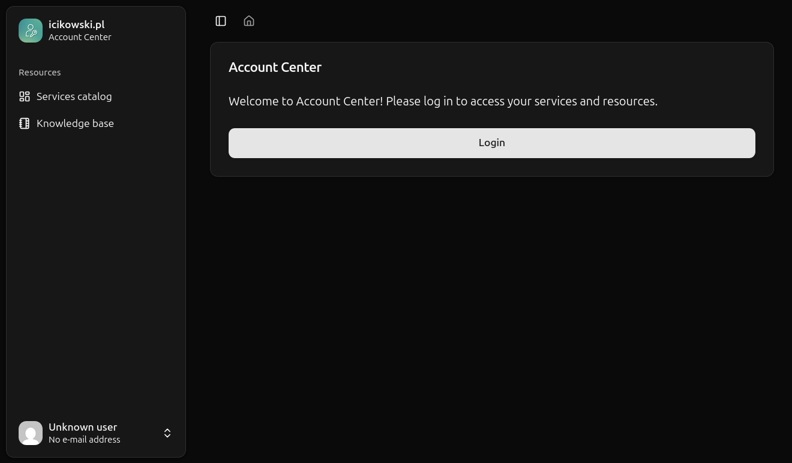
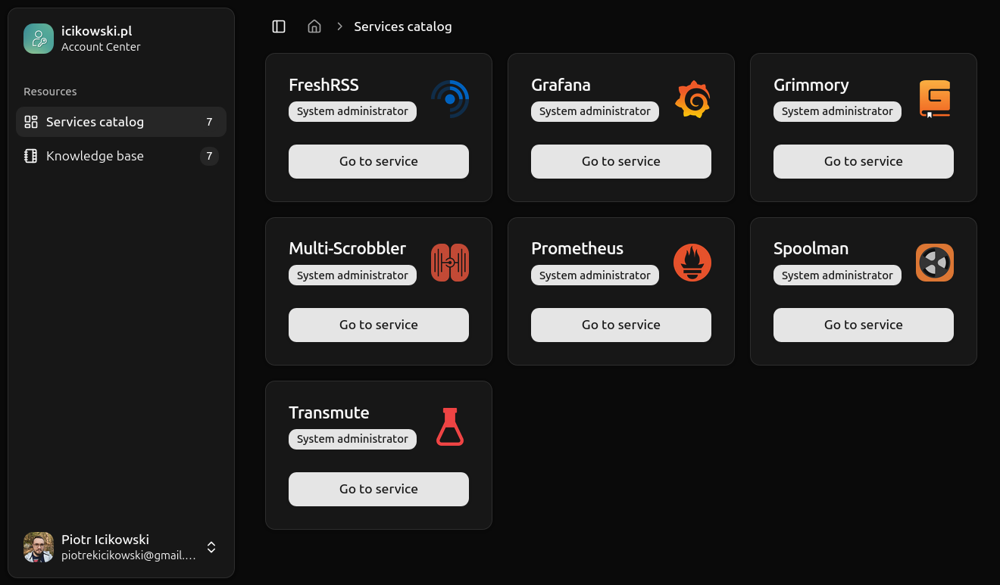
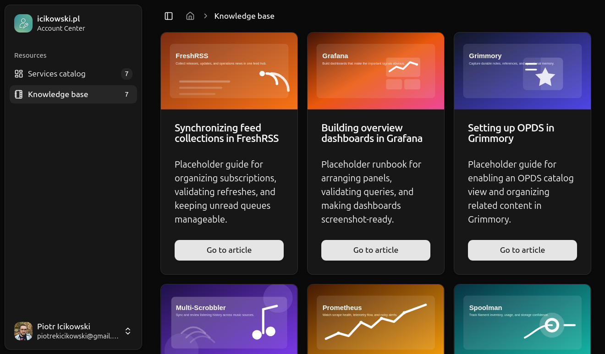
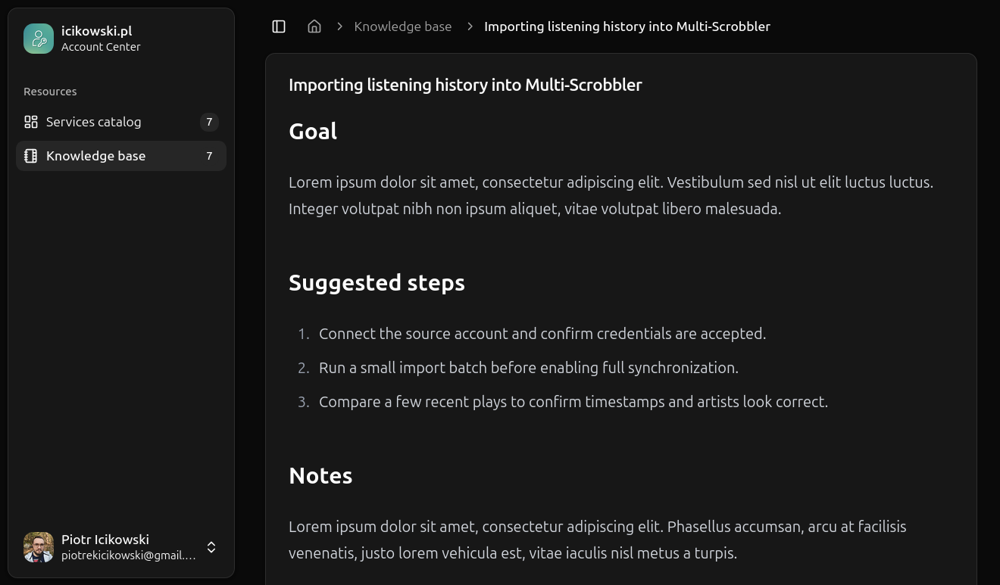

# Account Center

**Self-hosted OIDC portal for internal services and knowledge base content.**

**Account Center** gives operators one place to send users after login. It combines:

- OIDC sign-in with refresh-token support;
- a role-aware internal services catalog;
- an optional Markdown knowledge base.

It serves HTTP only - **terminate TLS/SSL at a reverse proxy in front of it**.

| Description            | Screenshot                                                                                                |
| ---------------------- | --------------------------------------------------------------------------------------------------------- |
| Login                  | [](docs/assets/screenshot-login.png)                     |
| Services catalog       | [](docs/assets/screenshot-catalog.png)      |
| Knowledge base listing | [](docs/assets/screenshot-kb-list.png)       |
| Knowledge base article | [](docs/assets/screenshot-kb-article.png) |

> **Warning**
>
> This repository is mirrored to GitHub. The SourceHut repository is the primary one.

## Overview

**Account Center** is built for self-hosted environments that already have:

- an identity provider;
- several internal tools;
- multiple user groups;
- scattered operational documentation.

It provides a single portal for:

- OIDC sign-in;
- group-based service visibility;
- Markdown knowledge base articles with assets.

Solution's highlights include:

- live reload for catalog and KB content;
- in-memory or Redis-backed sessions;
- reverse-proxy-aware deployment.

## Repository layout

| Path                     | Description                                        |
| ------------------------ | -------------------------------------------------- |
| `cmd/account-center`     | Main application entrypoint                        |
| `cmd/healthcheck`        | Docker-specific healthcheck entrypoint             |
| `internal/auth`          | OIDC flow, session handling, trusted proxy logic   |
| `internal/catalog`       | Catalog loading, validation, live reload           |
| `internal/config`        | Environment variable parsing and validation        |
| `internal/evaluator`     | Effective role calculation for visible services    |
| `internal/knowledgebase` | Markdown loading, validation, link/asset rewriting |
| `internal/web`           | HTTP routes, UI, assets, templates                 |
| `schemas`                | JSON schemas for catalog and KB front matter       |

## Documentation

| Topic                                                  | Purpose                                                              |
| ------------------------------------------------------ | -------------------------------------------------------------------- |
| [Configuration overview](docs/configuration.md)        | Runtime model, routes, live reload, storage and proxy handling       |
| [Environment variables](docs/environment-variables.md) | Reference for every `AC_*` variable                                  |
| [Deployment](docs/deployment.md)                       | Binary, Docker, Docker Compose and reverse proxy deployment guidance |
| [OIDC configuration](docs/oidc.md)                     | Provider requirements and a sanitized OIDC provider example          |
| [Services catalog](docs/services-catalog.md)           | YAML schema, roles and access evaluation rules                       |
| [Knowledge base](docs/knowledge-base.md)               | Enablement, layout, front matter, links and assets                   |

## Development

### Prerequisites

- Go 1.27+
- [`task`](https://taskfile.dev)
- [`golangci-lint`](https://golangci-lint.run)
- [`tailwindcss`](https://github.com/tailwindlabs/tailwindcss) binary (or `npx` if Tailwin CLI not installed)

### Common commands

```bash
task generate
task build
task run
task test
task lint
```

For live development:

```bash
task dev
```

### Setup

1. Start from `.env.example` or `docs/environment-variables.md`.
2. For local development, place the required `AC_*` variables in `.env`; the committed `.envrc` loads it with direnv.
3. Provide a valid catalog file and point `AC_CATALOG_PATH` at it.
4. Optionally enable the knowledge base with `AC_KB_ENABLED=true` and point `AC_KB_PATH` at the content directory.
5. If you are configuring Authelia, see [`docs/oidc.md`](docs/oidc.md).

## Contributing

The Go module path is `git.sr.ht/~icikowski/account-center`. Documentation links should treat SourceHut as the primary forge.

When contributing:

1. Run `task generate` after template, asset, or UI source changes.
2. Run `task fmt`, `task lint`, and `task test` before sending changes.
3. Update the docs when configuration, deployment behavior, or schemas change.
4. Keep changes focused and operator-friendly.

## Container images

Published images:

- `icikowski/account-center`
- `ghcr.io/icikowski/account-center`

See [`docs/deployment.md`](docs/deployment.md) for full examples.

## License

Licensed under the GNU AGPL v3. See [`LICENSE`](LICENSE).

## Disclaimer

Code was written in spare time, without AI assistance as I find vibed crap unmaintainable. Contributions are welcome, but every contributor is expected to review and test the code they submit and to be responsive to feedback on it. I will not merge contributions that I have not personally reviewed and tested.

Use at your own risk, and expect a personal project with limited support and no SLA. Contributions are welcome, but I can't promise any specific turnaround time or feature roadmap.
